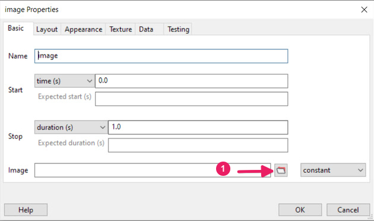
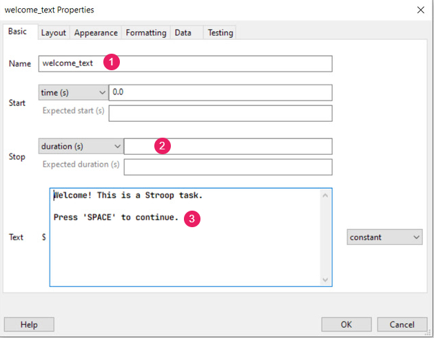
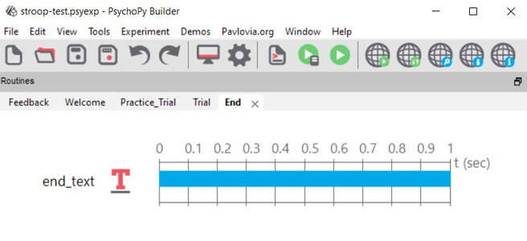
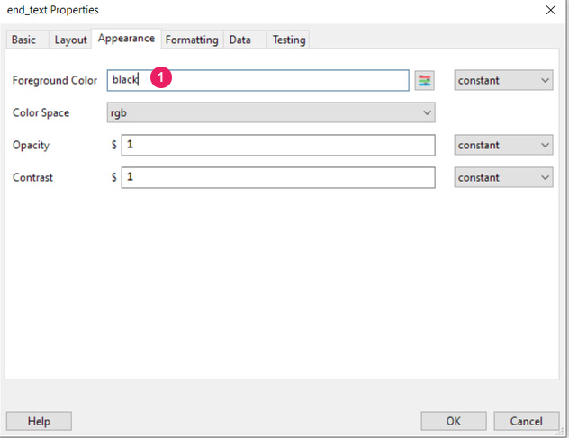
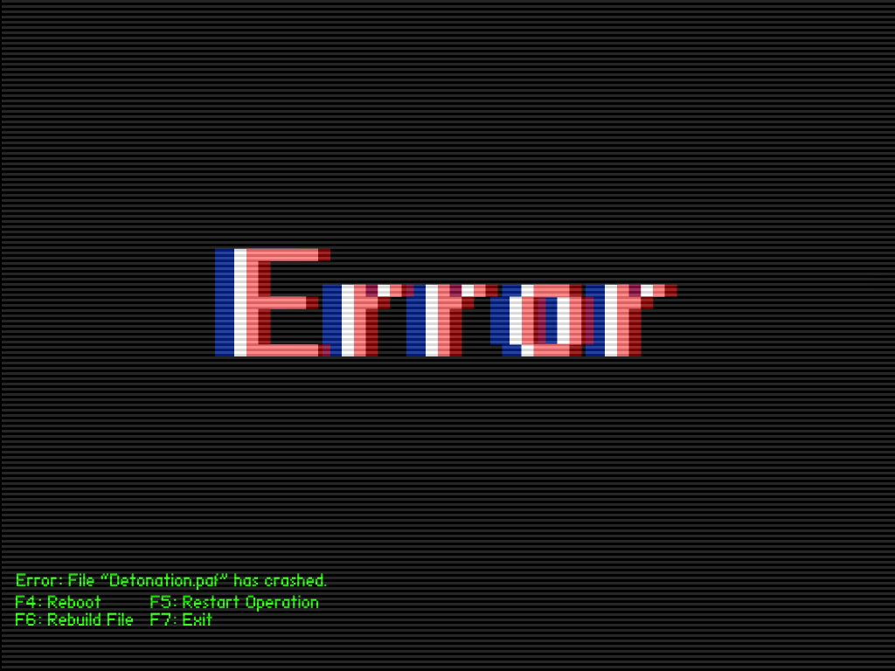

```{r setup, include=FALSE}
library(reticulate)
library(tidyverse)
library(xaringan)
library(xaringanExtra)
library(here)
library(knitr)
library(png)
library(patchwork)


options(htmltools.dir.version = FALSE)
knitr::opts_chunk$set(
  fig.width=9, fig.height=3.5, fig.retina=3,
  out.width = "100%",
  cache = FALSE,
  echo = TRUE,
  message = FALSE, 
  warning = FALSE,
  hiline = TRUE
)

```

```{r xaringan-tile-view, echo=FALSE, include=FALSE}
xaringanExtra::use_tile_view()
xaringanExtra::use_broadcast()
```

## Housekeeping Rules

- All of you will be muted during the Zoom session. If you need to ask a question, please feel free to use the chat box or raise your hand. 

- We have set up a Slack [Slack link here] for any technical difficulties during the session. Please ask your question by posting a new message in the .pink[\#Troubleshooting channel]. 

### Asking questions

- We encourage all the participants to contribute to the workshop by either asking questions or answering questions posted by other participants in Slack. 

- Before you ask any question, you might want to check the threads in the .pink[\#Troubleshooting channel] first, in case your question have been asked. 

- Our beloved TAs will be stationed at the .pink[\#Troubleshooting channel] to answer your questions. 

- This is a huge workshop, so please do understand if we can't get to your question immediately. However, please be assured that we will definitely answer your question, or at least direct you to someone who knows the answer. 


---

## Objectives
This workshop will:  

- introduce you all to the basic aspects of the PsychoPy Builder interface

- teach you how to create a simple experiment: .purple[Stroop task]

- teach you how to create a perception experiment: .purple[Navon task]

- help you launch your first online experiment on Pavlovia

- provide you some resources to go further

---
## Is this workshop suitable for me?

There is no pre-requisite programming knowledge needed for this workshop, except some knowledge on how to operate your laptop/desktop. 

- This is .pink[**NOT**] a programming workshop and you are not asked to know any programming language prior to attending this workshop. 

- We do some coding, and it is very _minimum_. It is fine if you do not understand the codes. Most of the time, we just _google_ for the answer. 

- Due to time constraint, we will NOT be able to cover all aspects of PsychoPy and Pavlovia. We encourage the participants to explore the links that we provide at the end of the workshop for more information.

- You can find [all material here <i class="fab fa-github"></i> ](https://github.com/sohmeiling/Workshop_M_Connect) or [download as zip here <i class="fa fa-download"></i> ](https://github.com/sohmeiling/Practical_Stroop/archive/refs/heads/main.zip)

---
layout: true
## What is PsychoPy?

---
- PsychoPy is an open-source package for running experiments in Python 
(a real and **free** alternative to Matlab) See [advantages of using PsychoPy.](https://www.psychopy.org/)

- There are two main ways of interacting with PsychoPy's ***Runner***. You can use the ***Builder*** or the script files (plain text files that contain your code in the ***Coder***).
    - A code editor(called ***Coder***)
    - A graphical user interface (called ***Builder***)
    - A console that runs the code (called ***Runner***)

- For beginners, you will spend most of your time at the ***Builder***<sup>1</sup> view. 

<br><br><br><br>

.footnote[.gray.bold[
[1] If you are using builder, make sure you are really happy with your ***Builder*** format before moving to coder.]]
---
- For those comfortable with programming, you can write Python code on the ***Coder***<sup>2</sup> view. You can refer to the [Reference API](https://www.psychopy.org/api/index.html#api) for the details of the dependencies used in the library.

--

.red[⚠️ **Friendly reminder**]

- Do not touch the ***Coder*** unless you know what you are doing, it’s a one-way street! Once a code is changed in the ***Coder***, you can no longer use the ***Builder***!

 

<br><br><br><br><br><br>

.footnote[.gray.bold[
[2] You can compile your experiment into a Python script using the .bg-main4[compile to script] button. Usual practice is to use a ***Builder*** to design most part of the experiment and only fine-tune the experiment using the .bg-main4[code] component. 
]]


---
layout:false

class: inverse, center, middle

# Introduction to PsychoPy

---
## Builder View

***Builder*** has three windows: Routines, Components, & Flow

```{r  out.width = "70%", dpi =96, echo=FALSE, fig.align="center"}
include_graphics("image/builder-view.png")
```

.footnote[.gray[Image taken from PsychoPy website https://www.psychopy.org/builder/builder.html]]
---
## Coder View

.column[
***Coder*** has two windows: `Integrated Development Environment (IDE) & Output
]

.column[
```{r  out.width = "45%", dpi =96, echo=FALSE, fig.align="center"}
include_graphics("image/coder-view.png")
```
]
---

## Experiment Setting

- __Experiment Info__: This information will be presented in a dialog box at the start and will be saved with any data files and so can be used for storing information about the current run of the study.

- __Units__: The default units of the window but these can be overriden by individual components.

```{r  out.width = "65%", fig.cap= "Figure. GIF for experiment settings", fig.align="center", dpi =96, echo=FALSE}
include_graphics("gif/experiment-setting.gif") 
```

---
layout: true

## The Toolbar

---

- The first few icons are probably obvious.

```{r  out.width = "20%", fig.align="center", dpi =96, echo=FALSE}

```

.center[.gray.bold[Figure 1. The first six toolbar's icons <br/>(New experiment<sup>1</sup>, Open<sup>2</sup>, Save<sup>3</sup>, Save As<sup>4</sup>, Undo<sup>5</sup>, Redo<sup>6</sup>)]]

- For other icons, if you .pink[hover over], you get a tool tip telling you what each icon does.

```{r  out.width = "20%", fig.align="center", dpi =96, echo=FALSE}

```

.center[.gray.bold[Figure 2. The next six toolbar's icons <br/> (Monitor Setting<sup>7</sup>, Experiment Setting<sup>8</sup>, <br/>Compile to Python Script<sup>9</sup>, Compile to JS Script<sup>10</sup>, Send experiment to Runner<sup>11</sup>, Run experiment<sup>12</sup>)]]
---


- The last five icons are new web icons. You will need these buttons to launch, sync, and run your projects in the Gitlab. 

```{r  out.width = "20%", fig.align="center", dpi =96, echo=FALSE}
include_graphics("image/toolbar-icons-3.png")
```

.center[.gray.bold[Figure 3. The last five toolbar's icons <br/> (Run the study online<sup>13</sup>, Sync with web project<sup>14</sup>, <br/>Find existing study online<sup>15</sup>, Log in<sup>16</sup>, View details of the project<sup>17</sup>)]]

Before you push your study online, you need to login to the Pavlovia. You can either login using the .bg-gray[Login icon] above _or_  login using the .bg-gray[Pavlovia.org] tab.

```{r  out.width = "35%", fig.align="center", dpi =96, echo=FALSE}
include_graphics("image/loginPavlovia.png")
```

.center[.gray.bold[Logging in on Pavlovia via the PsychoPy 3 Builder]]

---
layout: false

class: inverse, center, middle

# Any Question?

---
## Add New Routine

1. On the ***Flow*** window, select .bg-gray[Insert Routine]  ➡️ .bg-gray[ (new) ]
2. A new routine window will pop up. Enter a meaningful name for the new routine. Click 🆗 .
3. Now you should see your Routine Name appears as tab on top of the ***Routines*** window.

```{r  out.width = "65%", fig.cap= "GIF for adding new routine", fig.align="center",dpi =96, echo=FALSE}

```

---
layout: false

class: inverse, center, middle

# Moving on ...

---
layout: true

## Add New Component

---

1. On the ***Components*** window, select the type of component that you want. 
Under .bg-gray[Favorites], a few commonly used components are listed. 
2. They typically represent either stimuli (e.g. **Image** or **Text** Components), or methods of responding (e.g. **Mouse** or **Keyboard** Components)
3. Clicking on any of the components will result in a pop-up window. 

```{r  out.width = "50%", fig.cap= "GIF for adding new component", fig.align="center", dpi =96, echo=FALSE}
include_graphics("gif/add-new-component.gif")
```
---

- PsychoPy is an open-source program, so the components are continuously being updated. 

- In the latest version **(v2021.2.2)**, 33 components are available (updated on 2021-08-12). [More details here.](https://www.psychopy.org/builder/components.html)


```{r  out.width = "40%", fig.cap= "The library of the components available in the PsychoPy3 (v2020.2.10)️", dpi =96, fig.align="center", echo=FALSE}

```

---
class: split-two black
layout: false

### .purple[<br>Properties of Text Component<br>]

.column[

<br><br><br><br><br>
```{r out.width = "80%", dpi =96, echo=FALSE, fig.align='center'}
 
```

]

.column[

<br><br>

### .deep-purple[Text]

💻 **Basic** 

1️⃣ __ name(string)__: The name should contain only letters, numbers and underscores (no punctuation marks or spaces).

2️⃣ __start__: The time that the stimulus should first appear.

3️⃣ __stop__: The duration for which the stimulus is presented.

4️⃣ __text__: Text to be shown

]

???
Please note, we only cover the few functions that we use frequently.

---
class: split-two with-thick-border border-white

### .purple[<br>Properties of Text Component<br>]

.column[

<br><br><br><br><br>
```{r  out.width = "80%", fig.align='center', dpi =96, echo=FALSE}
 
```

<br><br>

.footnote.gray[
[1] See *Additional Materials* section or [*PsychoPy website*](https://www.psychopy.org/general/units.html) for more information.]

]


.column.black[

<br><br>

### .deep-purple[Text]

💻 **Layout**

1️⃣ __position__: [x, y] The position of the centre of the stimulus, in the units specified by the stimulus or window

2️⃣ __spatial Unit<sup>1</sup>__

- deg, cm, pix, norm, or inherit from window

- See Slide \#66 for more information. 

3️⃣ __orientation__:The orientation of the stimulus in degree.
]


---
layout: false
class: split-two with-thick-border border-white

### .purple[<br>Properties of Text Component<br>]

.column[

<br><br><br><br><br>
```{r  out.width = "80%", fig.align='center', dpi =96, echo=FALSE}
 
```

]


.column[

<br><br>

### .deep-purple[Text]

💻 **Appearance** 

1️⃣ __foreground color__: The color of the text

2️⃣ __color space__: We usually use RGB color space. All colors are represented by a triplet of values that specify the red green and blue intensities, with each value ranges from -1 to +1.

Examples:
- [1,1,1] is white
- [1.0,-1,-1] is red

<br>

.gray[Tips. You can right-click the mouse to select the color, instead of stating the RGB values.]


]

---
layout: false
class: split-two with-thick-border border-white

### .purple[<br>Properties of Text Component<br>]

.column[

<br><br><br><br><br>
```{r  out.width = "80%", fig.align='center', dpi =96, echo=FALSE}
 
```

]


.column[

<br><br>

### .deep-purple[Text]

💻 **Formatting** 

1️⃣ __font__: The font of the text

2️⃣ __letter height__: The height of the characters in the given units of the stimulus/window.

***Static and non-static stimuli*** 😥

⚠️ __Drop-down__: 
- .pink[Constant]: For static stimuli
- .pink[Set every repeat/ Set every frame]: For changing stimuli

]

???

Make sure that you explain "Static and non-static stimuli". 
---
layout: false
class: split-two with-thick-border border-white

### .purple[<br>Properties of Image Component<br>]

.column[

<br><br><br><br><br>
```{r  out.width = "80%", fig.align='center', dpi =96, echo=FALSE}
 
```

]

.column[

<br><br>

### .deep-purple[Text]

💻 **Basic** 

The rests are the same as the Text properties.

1️⃣ __image__: You can select the image file (e.g. tif, jpg, bmp, png, etc.) with the file icon. 

]

---
layout: false
class: split-two with-thick-border border-white

### .purple[<br>Properties of Image Component<br>]

.column[

<br><br><br><br><br>
```{r  out.width = "80%", fig.align='center', dpi =96, echo=FALSE}
 
```

]

.column[

<br><br>

### .deep-purple[Text]

💻 **Layout** 

The rests are the same as the Text properties.

1️⃣ __size [sizex, sizey]__: The size of the stimulus in the selected  units of the stimulus/window. 

- flip horizontal: Flip the image along the horizontal axis

- flip vertically: Flip the image along the vertical axis

<br><br>

.gray[.bold[Tips:] For image, it is best if we use set the pix units to appropriate dimension so that you don't exhaust your laptop processor memory space. Additonally, images which are square and powers of two (32, 64, 128, etc.)]

]

---
layout: false
class: split-two with-thick-border border-white

### .purple[<br>Properties of Image Component<br>]

.column[

<br><br><br><br><br>
```{r  out.width = "80%", fig.align='center', dpi =96, echo=FALSE}
 
```

]

.column[

<br><br>

### .deep-purple[Text]

💻 **Appearance** 

Exactly the same as the Text properties.

]

---
layout: false
class: split-two with-thick-border border-white

### .purple[<br>Properties of Image Component<br>]

.column[

<br><br><br><br><br>
```{r  out.width = "80%", fig.align='center', dpi =96, echo=FALSE}
 
```

]

.column[

<br><br>

### .deep-purple[Text]

💻 **Texture** 

Exactly the same as the Text properties.

1️⃣ __mask__: A second layer which overlays the image.

2️⃣ __texture resolution__: We use this as grating. 

3️⃣  __interpolate__: Interpolation is inbetweening, or filling in frames between the key frames. If linear is selected then linear interpolation will be applied when the image is rescaled to the appropriate size for the screen. Nearest will use a nearest-neighbour rule.
]


---
layout: false
class: split-two with-thick-border border-white

### .purple[<br>Properties of Keyboard Component<br>]

.column[

<br><br><br><br><br>
```{r  out.width = "80%", fig.align='center', dpi =96, echo=FALSE}
 
```

]

.column[

<br><br>

### .deep-purple[Text]

💻 **Basic** 

Almost identical as the Text and Image properties.

1️⃣ __Force end of Routine__: If this box is checked then the_ Routine_ will end as soon as one of the allowed keys is pressed.

2️⃣ __Allowed keys__: A list of allowed keyboard keys

]

---
layout: false
class: split-two with-thick-border border-white

### .purple[<br>Properties of Keyboard Component<br>]

.column[

<br><br><br><br><br>
```{r  out.width = "80%", fig.align='center', dpi =96, echo=FALSE}
 
```

]

.column[

<br><br>

### .deep-purple[Text]

💻 **Data** 


1️⃣ __Store__: Store either last key, first key, all keys, nothing. The response time will also be stored if a keypress is recorded. 

2️⃣ __Store correct__: Check this box if you wish to store whether or not this key press was correct.

3️⃣ __Correct Answer__: Defines what would constitute a correct answer e.g. left, 1 or  $corrAns 

<br>

⚠️ .gray[If you want to collect responses from a participant, you need to select all the three functions above, or else your experiment will just run. More information is available at the [PsychoPy webpage](https://www.psychopy.org/builder/components/keyboard.html)]

]


---
layout: false

## Add New Loop in the Flow

- We use ***Flow*** to combine a few ***Routines*** into a single experiment.
- Loops control the .bg-main3[repetition] of Routines and the choice of bg-main3[stimulus parameters] for each. 

```{r  out.width = "60%", fig.align="center", fig.cap= "GIF for adding new loop", dpi =96, echo=FALSE}
 
```

---
layout: false

class: inverse, center, middle

# Let's start<br><br>(Designing Stroop Task)

---
layout: true

# .gray[Stroop Task]

---

The Stroop effect is the finding that naming the color of the first set of words is easier and quicker than the second.

- In the figure shown below, the words corresponding to the colors “Red,” “Green,” and “Blue” are included, but printed in colors that do not correspond to the word (e.g., the word “Red” is printed in blue). 

- The task is to name the ink color, inhibiting the reading of the word, and the score is the number of correctly named elements. 

```{r  out.width = "40%", fig.align="center", dpi =96, echo=FALSE}
include_graphics("gif/stroop.gif")
```
---

### Step 1: Download files needed

Download and unzip the file from [Github](https://github.com/sohmeiling/Workshop_M_Connect) or [download as zip here <i class="fa fa-download"></i> ](https://github.com/sohmeiling/Workshop_M_Connect/archive/refs/heads/main.zip). Remember to save the folder in the .red[Desktop ]

⚠️  .pink[Warning!! Do not save the folder on a cloud-based storage such as OneDrive or Dropbox). It should be in the C::drive]

<br>
--

### Step 2: Open the PsychoPy3 Builder

In the unzipped folder, you should see multiple folders. Open the **.psyexp** file under the **practical-stroop** folder

Practical_Build_Stroop  ➡️ stroop-test.psyexp

Select the .pink[stroop-test.psyexp]  ➡️  .pink[right-click]  ➡️ .pink[open with PsychoPy]

.footnote[
.gray[Note. A readme file will pop up when you open the file. Please briefly glance through the study information before you exit the readme file.]]

---
layout: false

class: inverse, center, middle

# Any problems?

---
layout: true

# .gray[Stroop Task]

---

### Step 3: Create Stimuli

Before you create any experiment, it is important that you are familiar with the task. We designed our study based on the Stroop Color and Word Test (SCWT) in Rivera's et al. (2015) study.

There are three kinds of Stroop task: _Stroop Word_, _Stroop Color_, and _Stroop Word-Color_. We will start with _Stroop Word Task_.

> _Stroop Word Task_. The words corresponding to the colors “Red,” “Green,” and “Blue” are included, and all are printed in black ink. 


```{r  out.width = "70%", fig.align="center", fig.cap= "Stroop Task", dpi =96, echo=FALSE}

```
---

### Step 3: Create Stimuli
We need to list out all the possible combinations of **Word Stroop**. We have created the stimuli file for you. It is in the .bg-gray[.bold[Practical_Build_stroop]] folder. Please use the .pink[**wordPractice_stim.xlsx**] for the following task.

--

```{r, echo=FALSE, fig.align='center', out.width = "30%"}

dmx <- tibble(type = c("Word", "Word", "Word"), 
  practiceWord = c("red", "green", "blue"), 
  practiceColor = c("black", "black", "black"), 
  corrResponse = c("left", "up", "right")
)

knitr::kable(head(dmx), format = 'html', align = 'c')

```

In the .xlsx file, there are _four_ variable names. 

- **type**. The type of Stroop Task

- **practiceWord**. The words presented on the screen

- **practiceColor**. The colors of the words

- **corrResponse**. The correct key responses/Answer

---
layout: true

# .gray[Stroop Task]

### Step 4: Create three routines

---

We need to create three routines in the .pink[stroop-test.psyexp]:
- Routine 1: .bg-gray[Welcome] Routine (name it "Welcome")
- Routine 2: .bg-gray[Practice] Routine (name it "Practice_Trial")
- Routine 3: .bg-gray[End] Routine (name it "End")

--

.teal[When it comes to naming the **Routine**, **variables**, and **Loop**, there are a few rules that you have to follow. For example, 
1.  Variables names must start with a letter or an underscore
2. The remainder of your variable name may consist of letters, numbers and underscores. Space is not allowed.
3. **Names are case sensitive**]

---

For the purpose of this workshop, we have created the routines for you. Now, let us arrange the routines in the ***Flow*** window. You can click the .bg-gray[Insert Routine]. Please arrange the routines as shown in the figure below. 

```{r  out.width = "50%", fig.align="center", fig.cap= "Stroop Task", dpi =96, echo=FALSE}

```
---
layout: true

# .gray[Stroop Task]

### Step 5: Create components for each routine

---

In the .bg-main3[**Welcome**] routine, create two components. 

- Component 1: A **Text** component (name it "welcome_text")
- Component 2: A **Keyboard** component (name it "welcome_resp")

```{r  out.width = "60%", fig.align="center", dpi =96, echo=FALSE}

```

.center[.gray[Welcome Routine]]

---
Properties for .bg-main4[welcome_text] component

.left-column[

<br><br>

.font_medium[.pink[Basic]]

.font_medium[Appearance]

.font_medium[Formatting]

]

.right-column[

```{r  out.width = "70%", fig.align="center", dpi =96, echo=FALSE}

```

]

---
Properties for .bg-main4[welcome_text] component

.left-column[

<br><br>

.font_medium[Basic]

.font_medium[.pink[Appearance]]

.font_medium[Formatting]

]

.right-column[

```{r  out.width = "70%", fig.align="center", dpi =96, echo=FALSE}

```

]

---
Properties for .bg-main4[welcome_text] component

.left-column[

<br><br>

.font_medium[Basic]

.font_medium[Appearance]

.font_medium[.pink[Formatting]]

]

.right-column[

```{r  out.width = "70%", fig.align="center", dpi =96, echo=FALSE}

```

]

---
Properties for .bg-main4[welcome_resp] component

.left-column[

<br><br>

.font_medium[.pink[Basic]]

.font_medium[Data]

]

.right-column[

```{r  out.width = "70%", fig.align="center", dpi =96, echo=FALSE}

```

]

---
Properties for .bg-main4[welcome_resp] component

.left-column[

<br><br>

.font_medium[Basic]

.font_medium[.pink[Data]]

]

.right-column[

```{r  out.width = "70%", fig.align="center", dpi =96, echo=FALSE}

```

]

---

In the .bg-main3[**Practice_Trial**] routine, create two components. 

- Component 1: A **Text** component (name it "practice_text")
- Component 2: A **Keyboard** component (name it "practice_resp")

```{r  out.width = "60%", fig.align="center", dpi =96, echo=FALSE}
include_graphics("image/practice_trial.png")
```

.center[.gray[Practice_Trial Routine]]

---
Properties for .bg-main4[practice_text] component

.left-column[

<br><br>

.font_medium[.pink[Basic]]

.font_medium[Appearance]

.font_medium[Formatting]

]

.right-column[

```{r  out.width = "70%", fig.align="center", dpi =96, echo=FALSE}

```

]

---
Properties for .bg-main4[practice_text] component

.left-column[

<br><br>

.font_medium[Basic]

.font_medium[.pink[Appearance]]

.font_medium[Formatting]

]

.right-column[

```{r  out.width = "70%", fig.align="center", dpi =96, echo=FALSE}

```

]

---
Properties for .bg-main4[practice_text] component

.left-column[

<br><br>

.font_medium[Basic]

.font_medium[Appearance]

.font_medium[.pink[Formatting]]

]

.right-column[

```{r  out.width = "70%", fig.align="center", dpi =96, echo=FALSE}

```

]

---
Properties for .bg-main4[practice_resp] component

.left-column[

<br><br>

.font_medium[.pink[Basic]]

.font_medium[Data]

]

.right-column[

```{r  out.width = "70%", fig.align="center", dpi =96, echo=FALSE}

```

]

---
Properties for .bg-main4[practice_resp] component

.left-column[

<br><br>

.font_medium[Basic]

.font_medium[.pink[Data]]

]

.right-column[

```{r  out.width = "70%", fig.align="center", dpi =96, echo=FALSE}

```

]


---

In the .bg-main3[**End**] routine, create one components. 

- Component 1: A **Text** component (name it "end_text")


```{r  out.width = "60%", fig.align="center", dpi =96, echo=FALSE}

```

.center[.gray[End Routine]]

---
Properties for .bg-main4[end_text] component

.left-column[

<br><br>

.font_medium[.pink[Basic]]

.font_medium[Appearance]

.font_medium[Formatting]

]

.right-column[

```{r  out.width = "70%", fig.align="center", dpi =96, echo=FALSE}

```

]

---
Properties for .bg-main4[end_text] component

.left-column[

<br><br>

.font_medium[Basic]

.font_medium[.pink[Appearance]]

.font_medium[Formatting]

]

.right-column[

```{r  out.width = "70%", fig.align="center", dpi =96, echo=FALSE}

```

]

---
Properties for .bg-main4[end_text] component

.left-column[

<br><br>

.font_medium[Basic]

.font_medium[Appearance]

.font_medium[.pink[Formatting]]

]

.right-column[

```{r  out.width = "70%", fig.align="center", dpi =96, echo=FALSE}

```

]

---
layout: true

# .gray[Stroop Task]

### Step 6: Create a loop in the Flow window

---

In the ***Flow*** window, .bg-main3[Insert Loop] around the .bg-main3[**Practice_Trial**] routine. Name the new loop, .bg-main3[**practice_loop**]

```{r  out.width = "60%", fig.align="center", dpi =96, echo=FALSE}

```


---
Properties for .bg-main4[practice_loop] component

.left-column[

Make sure you are in the correct directory. If you follow earlier instruction and have saved your folder in the **Desktop**, then your filepath should be

```{r}

# Desktop\Practical_Build_stroop\wordPractice_stim.xlsx

```

]

.right-column[

```{r  out.width = "60%", fig.align="center", dpi =96, echo=FALSE}

```

]

---
### Step 7: Save and run the study

- Make sure you consistently save your psyexp file as you program the study

- If you receive an error message, please approach the TAs in the chat. It will be helpful if you can copy and paste the error message into the chat. 

```{r  out.width = "20%", fig.cap= "Well done!", fig.align="center", dpi =96, echo=FALSE}
include_graphics("gif/good-job.gif")
```

We will take a 10-minute break now. For those interested of customizing the study, please try out the practice tasks in the next two slides. 

---
layout: false

class: inverse, center, middle

# Break Time ...

---
layout: false

### Practice Time (5-10 minutes) - Optional

- In the **Welcome** routine, modify the .bg-main4[welcome_text] component. You might want to include a longer instruction for the Stroop task. For example, 

> Welcome! This is a Stroop task. <br/> 
> <br/> 
> In this task, you are asked to respond to either the words or the colors printed in “Red,” “Green,” and “Blue”. <br/> 
> <br/> 
> Select 'LEFT' for red, 'UP' for green, 'RIGHT' for blue. <br/> 
> <br/> 
> Press 'SPACE' to continue.

- In the .bg-main4[welcome_text] component, you can always change the color of the text. Please make sure that it follows the [accessibility code](https://www.washington.edu/accessibility/web/color/). 


---

### Practice Time (5-10 minutes) - Optional

- In the **Practice_Trial** routine, add another Text component to remind your participants about the keys' response. You will need to adjust the position of the text component. As we are using *height* as our unit, the range for [x, y] position is [-0.8 <x <0.8,  -0.5<y< 0.5]

> Select 'LEFT' for red, 'UP' for green, 'RIGHT' for blue.

---

### Practice Time (5-10 minutes) - Optional

- In the **Experiment Settings**, add some demographic information such as age and gender to the _Experiment Info_.  

- Also, in the **Experiment Settings**, try to change the color of the screen. Now, it is set to grey. (Tips: under the Screen tab)


---
layout: true

# .gray[Stroop Task]
### Step 8: Create the Trial routine

---

- The .bg-main4[**Trial routine**] is identical to the earlier .bg-main4[**Practice_Trial**] routine. 

--

- Now, your task is to create the components for the .bg-main3[**Trial**] routine. 
    1. Insert the .bg-main3[**Trial**] Routine
    2. Create a Text component
    3. Create a Keyboard component
    4. Insert a Loop. Use the .pink[_WordStimuli.xlsx_]  file. 

--

- After you are done, try to run the experiment. 


---

Now, let's create another ***Routine***. After the .bg-main3[**Practice_Trial**], the participants will attempt the experiment. We can name this new routine, .bg-main3[**Trial**]. 

In the .bg-main3[**Trial**] routine, create two components and loop the routine. 

- Component 1: A **Text** component (name it "trial_text")
- Component 2: A **Keyboard** component (name it "trial_resp")
- Loop (name it "trial_loop")

.footnote[.gray[
If you are unsure of how to Insert New Routine, Create New Component, or Insert Loop, please refer to the previous slides.
]]

---

- Here's how your ***Routine*** should look like.

```{r  out.width = "60%", fig.align="center", dpi =96, echo=FALSE}

```

- After you are done, try to run the experiment. 


---
layout: false

class: inverse, center, middle

# 🍀 Try it out yourself 🍀

---

<br>

- Did you receive an error message?  


--

```{r  out.width = "20%", fig.cap= "Arghhhh!!!! What happened?", fig.align="center", dpi =96, echo=FALSE}

```

--
```{r  out.width = "10%", fig.cap= "Hmmmm.....", fig.align="center", dpi =96, echo=FALSE}

```


---
layout: true

## Stroop Task

### Step 9: Understanding the error

---

.pull-left[
- First, let's look into the Excel file used for .bg-main4[Practice_Trial] routine (.teal[_WordPractice_stim.xlsx_]  file). 

```{r, echo=FALSE, fig.align='center', out.width = "30%"}

dmx <- tibble(type = c("Word", "Word", "Word"), 
  practiceWord = c("red", "green", "blue"), 
  practiceColor = c("black", "black", "black"), 
  corrResponse = c("left", "up", "right")
)

knitr::kable(head(dmx), format = 'html', align = 'c')

```
]


.pull-right[
- You should realize that the variables' names are .pink[different]. 

```{r practice, echo=FALSE}
stim <- tibble(type = rep("Word", 6), 
               word = rep(c("red", "blue", "green"), each= 2), 
               color = rep("black", 6), 
               answer = rep(c("left", "right", "up"), each= 2)
               )
               
knitr::kable(head(stim), format = 'html')

```

]

---

So, how do we fix the error?  🤔

```{r echo=FALSE}

naming <- tibble(old_names = c("type", "practiceWord", "practiceColor", "corrResponse"), 
                 new_names = c("type", "word", "color", "answer"))

knitr::kable(head(naming), format = 'html')
```


 💭 Make changes in the .bg-main4[**trial_text**] and .bg-main4[**trial_resp**] components. 

---
layout: false

### Answer

```{r  out.width = "100%", fig.align="center", dpi =96, echo=FALSE}

```

---
layout: true

# .gray[Stroop Task]
### Step 10: Launch the study online

---
Before you push your study to Pavlovia, make sure that: 

1. You have login into your Pavlovia account. 
2. You have test-run the experiment and it works on PsychoPy. 

--

```{r  out.width = "50%", fig.cap= "GIF for launching online", fig.align="center", dpi =96, echo=FALSE}
include_graphics("gif/push-to-pavlovia.gif")
```

---

- Next, let's move to Pavlovia to check if your experiment has been uploaded successfully. 🤞


```{r  out.width = "50%", fig.align="center", dpi =96, echo=FALSE}

```


---
layout: true

# .gray[Stroop Task]
### Step 11: Counterbalancing

---

.deep-purple[Blocking similar conditions] 

Counterbalancing requires a bit of thinking! In our Stroop Task, we have three types of Stroop but if you look carefully, these three tasks are very similar. So, you should not create different Routines for different trials in your blocks (if at all possible). 

- Look at the .xlsx file for the **Practice_Trial** routine. We have created two .xlsx files: Word Stroop practice file (.pink[wordPractice_stim.xlsx]) and Color Stroop practice file (.pink[colorPractice_stim.xlsx]) . Both _xlsx_ files have identical variable names. 

<br/>

.pull-left[
```{r  out.width = "100%", fig.cap= "wordPractice_stim.xlsx", dpi =96, echo=FALSE}

```

]

--
.pull-right[
```{r  out.width = "80%", fig.cap= "colorPractice_stim.xlsx", dpi =96, echo=FALSE}

```

]

---

We can collapse both files into a single ***Loop***. 

--
1. First, look at the conditions.xlsx file. 

```{r  out.width = "30%", fig.cap= "The conditions.xlsx file", fig.align="center", dpi =96, echo=FALSE}

```

2. Next create a loop around the Practice_Trial and Trial routines. 

```{r  out.width = "60%", fig.cap= "The Flow layout", fig.align="center", dpi =96, echo=FALSE}
include_graphics("image/counter-loop.png")
```


---

1. In the outer (blocks) loop you set up the conditions file to be conditions.xlsx which creates a variable practiceFile. 

2. Then, in the inner (trials) loop you set the conditions file not to be any file directly but simply $practiceFile. 

3. When PsychoPy starts the loop, it will find the current value of practiceFile and insert the appropriate thing, which will be the name of an conditions file and voila, we're done with counterbalancing. 

--

```{r  out.width = "20%", fig.align="center", dpi =96, echo=FALSE}

```

---
layout: true

# .gray[Stroop Task]
### Practice Time (5-10 minutes)

---
.deep-purple[***Practice***]

1. This time, you try to create a counterbalancing loop for the **Trial** routine. Refer to the conditions.xlsx file. 

2. [Difficult] Try to add instructions for your participants, informing them if the following trial is a Word Stroop, Color Stroop, or Word-color Stroop. You will need to consider the structure of the loop.


---
layout: false

class: inverse, center, middle

# Part 2 <br/> <br/>(Advanced Functions)

---
layout: true

# .gray[Stroop Task]
### Step 12: Add a feedback Loop
---

1. Create a new routine for your Feedback (name it "Feedback").

2. Create two new components for your Feedback routine: 

    - A Text component (name it "feedback_text")
    - A Code<sup>3</sup> component; can be found under Custom (name it "code")

```{r  out.width = "60%", fig.align="center", dpi =96, echo=FALSE}

```

.footnote[
.gray[[3] The .pink[code] component has to be at the top of the routine.]
]

---

<br> 

```{r  out.width = "60%", fig.align="center", dpi =96, echo=FALSE}

```

---

Properties for .bg-main4[feedback_text] component

.left-column[

<br><br>

.font_medium[.pink[Basic]]

.font_medium[Appearance]

.font_medium[Formatting]

]

.right-column[

```{r  out.width = "70%", fig.align="center", dpi =96, echo=FALSE}

```

]

---

Properties for .bg-main4[feedback_text] component

.left-column[

<br><br>

.font_medium[Basic]

.font_medium[.pink[Appearance]]

.font_medium[Formatting]

]

.right-column[

```{r  out.width = "70%", fig.align="center", dpi =96, echo=FALSE}
include_graphics("image/feedback_text2.png")
```

]

---

Properties for .bg-main4[feedback_text] component

.left-column[

<br><br>

.font_medium[Basic]

.font_medium[Appearance]

.font_medium[.pink[Formatting]]

]

.right-column[

```{r  out.width = "70%", fig.align="center", dpi =96, echo=FALSE}

```

]

---

Properties for .bg-main4[code] component

.left-column[

.font_medium[Before Experiment]

.font_medium[.pink[Begin Experiment]]

.font_medium[Begin Routine]

.font_medium[Each Frame]

.font_medium[End Routine]

.font_medium[End Experiment]

]

.right-column[

```{r  out.width = "70%", fig.align="center", dpi =96, echo=FALSE}

```

]

---

Properties for .bg-main4[code] component

.left-column[

.font_medium[Before Experiment]

.font_medium[.pink[Begin Experiment]]

.font_medium[Begin Routine]

.font_medium[Each Frame]

.font_medium[End Routine]

.font_medium[End Experiment]

]

.right-column[

Under **Begin Experiment**

```{r eval=FALSE}

msg= ""
```

.gray[
This allows us to define the message depending on the performance of the participant]
]


---

Properties for .bg-main4[code] component

.left-column[

.font_medium[Before Experiment]

.font_medium[Begin Experiment]

.font_medium[.pink[Begin Routine]]

.font_medium[Each Frame]

.font_medium[End Routine]

.font_medium[End Experiment]

]

.right-column[

Under **Begin Routine**

```{r  eval=FALSE}

if not practice_resp.keys:
    msg = "Failed to respond"
elif practice_resp.corr:
    msg = "Correct!"
else:
    msg = "Oops! That was wrong."

```

.gray[Under **Begin Routine** tab, you now define what the .bg-main[msg] object contains using a simple if-else statement

]]

---

.pull-left[
Under **Begin Routine**

```{r  eval=FALSE}


* if not practice_resp.keys:
*    msg = "Failed to respond"
elif practice_resp.corr:
    msg = "Correct!"
else:
    msg = "Oops! That was wrong."

```

]

.pull-right[

<br>

If participants did not press any of the response keys, the .bg-gray[msg] object will now contain .red[“Failed to respond”]

]

---

.pull-left[
Under **Begin Routine**

```{r  eval=FALSE}


if not practice_resp.keys:
    msg = "Failed to respond"
*  elif practice_resp.corr:
*    msg = "Correct!"
  else:
    msg = "Oops! That was wrong."

```

]


.pull-right[

<br>

If participants pressed the correct response key, the **msg** object will now contain .red[“Correct!”]

]
---

.pull-left[
Under **Begin Routine**

```{r  eval=FALSE}


if not practice_resp.keys:
    msg = "Failed to respond"
  elif practice_resp.corr:
    msg = "Correct!"
*  else:
*    msg = "Oops! That was wrong."

```

]


.pull-right[

<br>

If participants pressed the wrong response key, the msg object will now contain .red[“Oops! That was wrong”]

]
---
layout: false

## Troubleshooting

.pull-left[
- The Runner is your best friend here! Errors will be logged here, and you can usually identify the problem from the last couple of lines that caused the experiment to crash

- For example, this experiment crashed because my Stroop color stimulus was not defined. This means that one of the components may not have been set up properly

- If you’re not sure what the error means, you can always copy paste the error into Google ending with “psychopy”

- Results would often point you to https://discourse.psychopy.org, where you can find resources to assist you in debugging

]

.pull-right[

```{r  out.width = "90%", fig.align="center", dpi =96, echo=FALSE}

```

]

---

## Useful tips

- Its handy to know how to skip portions of your experiment. If you have a 15-minute experiment, you don’t want to sit through the whole experiment just to troubleshoot one specific block

- To do this, insert an **empty loop** between the sections that you want to skip and set nReps to 0

```{r  out.width = "60%", fig.align="center", dpi =96, echo=FALSE}

```

---

## General Advice

- If you’ve updated your PsychoPy, but your experiments were coded in a previous version, you may want to force PsychoPy to use an older version 

```{r  out.width = "35%", fig.align="center", dpi =96, echo=FALSE}

```


- Be consistent with your naming! Keep it simple and logical so that future you won’t be clueless. This is especially crucial if you are collaborating with others, having consistent and logical names for your codes / components / routines / stimuli would make it so much easier!


---

## Common Errors

- Stimulus not Appearing
    - Have you check if your stimulus is too big? (i.e. Letter Height, Image Height)
    - Have you checked if your stimulus is positioned off screen?
    
- Stimulus not Changing after Every Loop
    - Have you checked that your stimuli has been correctly set to “Set every repeat”? 
    
- Wrong Stimulus Set 
    - Have you remembered to put a “$” before your variables?
    - Did you specify the correct excel file in your Loop?
    - Remember: stimulus.xlsx is different than Stimulus.xlsx
    
- AttributeError: ‘unicode object has no attribute ‘XXXX’
    - Have you checked that you are calling ($) the correct variable name?

---
class: inverse, center, middle

# Additional Materials
---
layout: true

## Units and Scaling

---
- An important factor to consider when running online experiments is the standardization of stimuli size across participants who will likely be using different monitors. 

- To do so, we need to know a bit about the types of units in PsychoPy:

.center[]

```{r  out.width = "30%", fig.cap= "Drop-down list for units", fig.align="center", dpi =96, echo=FALSE}
include_graphics("image/units-dropdown.png")
```

---

- **Height**

    - Everything is specified relative to the height of the window (note the window, not the screen). For a standard widescreen (16:10 aspect ratio) the bottom left of the screen is (-0.8,-0.5) and top-right is (+0.8,+0.5).

- **Norm**

    - Everything is specified relative to the X, Y dimensions of the window (note the window, not the screen). In normalised (‘norm’) units the window ranges in both x and y from -1 to +1. That is, the top right of the window has coordinates (1,1), the bottom left is (-1,-1). 

---

- **Cm**

    - Set the size and location of the stimulus in centimeters on the screen, can be verified by “drawing” a stimulus and measuring the dimensions to check that its indeed a square

- **Deg/DegFlat/DegFlatPos**

    - Use degrees of visual angle to set the size and location of the stimulus. Dependent on the distance that the participant sits from the screen as well as the screen itself

- **Pix**

    - Specify the size and location of your stimulus in pixels, Dependent on the pixel size of monitor (note that all monitors differ in pixel size)

---
### Friendly Advice

😉 We recommend sticking to **Height** and **Norm** units if your experiment is not too concerned with stimulus size. 

😉 If stimulus size needs to be kept constant, then using **Cm, Deg, Pix** units is recommended as those do not scale with window size

---
### This is for the PRO ones

- Typically, we can standardize stimuli according to participants’ window dimension by getting participants to compare a common real-world object with a standardized size on the screen (i.e. credit cards). 

- Scaling task allows the experiment to obtain the dimensions of the screen relative to each participant, and you can then use that information to scale your stimuli accordingly. 


.center[]
.center[TIP: You can find many experimental templates like this on Pavlovia
]

---
background-image: url("image/wakefield-screen-scale.png")
background-position: center
background-size: contain

layout: false

---
layout: true

## Data Analysis

---

- Running experiments offline would store participants data locally on your hard drive. Using Pavlovia, participants data are stored in the cloud

- Data for **each** participant would be stored in an .csv file. If you have 50 participants, you will have 50 .csv files

- Usually, you would need to use some coding software (e.g. Python, R) to clean your data and aggregate them 

- For the purposes of this workshop, we will not go over how to clean/aggregate your data, rather, we will explore the kinds of raw data you can obtain

- At this stage, if your naming of your routines/components are not consistent or clear, you may have a very rough time understanding what’s going on. Particularly if you are collaborating with others, its very crucial to have simple naming rules.

---
### Explore your data file

- In your data file, there are some keywords that can help you identify the type of data being stored:


| variables' name | Description 
| :---: | :---: 
| .thisRepN/TrialN/N/Index | Counts how many stimuli/trials have passed
| .start/stopped | Counts the seconds when a stimulus is presented/stopped
| .keys | Logs the key press by the participants
| .rt | Logs the reaction time (seconds) taken to press a valid key(s)
| .corr | Logs the accuracy (1 = correct, 0 = wrong)

---
layout: false

class: inverse, center, middle

# Navon Task

---

# .deep-purple[Navon Task]

🖥️ We have programmed a practice task for you in the folder "Navon additional practice". 

🖥️ For those adventurous ones, you can refer to the.pink[ "Navon task instruction.ppt"] manual in the .pink["Navon additional practice"] folder.


---
class: inverse, center, middle


## Thank you!<br><br><br>Questions? 

--

#### <br>As you know, we are all in the Slack group. Please direct your questions there 😊] 

---
class: center, middle

# Thanks!

Slides created via the R packages:

[**xaringan**](https://github.com/yihui/xaringan)<br> 
[gadenbuie/xaringanthemer](https://github.com/gadenbuie/xaringanthemer)

The chakra comes from [remark.js](https://remarkjs.com), [**knitr**](http://yihui.name/knitr), and [R Markdown](https://rmarkdown.rstudio.com).
