```{r setup, include=FALSE}
library(tidyverse)
library(xaringan)
library(xaringanExtra)
library(here)
library(knitr)
library(png)

options(htmltools.dir.version = FALSE)
knitr::opts_chunk$set(
  fig.width=9, fig.height=3.5, fig.retina=3,
  out.width = "100%",
  cache = FALSE,
  echo = TRUE,
  message = FALSE, 
  warning = FALSE,
  hiline = TRUE
)

```
## Objectives
This workshop will:  

- introduce you all to the basic aspects of the PsychoPy Builder interface

- teach you how to create a simple experiment; the Stroop task

- teach you how to create a perception experiment: the Navon task

- help you launch your first online experiment on Pavlovia

- provide you some resources to go further

---
## Pre-requisite

### Is this workshop suitable for me? 

There is no pre-requisite programming knowledge for this workshop, except some knowledge on how to operate your laptop/desktop. 

- This is **NOT** a programming workshop and you are not asked to know any programming language prior to attending this workshop. 

- We do some coding, and it is very minimum. It is fine if you do not understand the codes. Most of the time, we just _google_ for answer. 

- Due to the limited time, we will NOT be able to cover all aspects of PsychoPy and Pavlovia. We encourage the participants to explore the links that we provide at the end of the workshop for more information. 

---
## What is PsychoPy?

- PsychoPy is an open-source package for running experiments in Python 
(a real and **free** alternative to Matlab) See [advantages of using PsychoPy](https://www.psychopy.org/)

- It has three windows: 
    - A code editor(called ***Coder***)
    - A graphical user interface (called ***Builder***)
    - A console that runs the code (called ***Runner***)

- For beginners, you will spend most of your time at the ***Builder***<sup>1</sup> view. 

- For those comfortable with programming, you can write Python code on the ***Coder***<sup>2</sup> view.
You can refer to the [Reference API](https://www.psychopy.org/api/index.html#api) for the details of the dependencies used in the library.


.footnote[
[1] If you are using builder, make sure you are really happy with your ***Builder*** format before moving to coder.

[2] Only use ***Coder*** to fine-tune the experiment. You can compile your experiment into a Python script using the `compile to script` button. The best practice is to use a ***Builder*** to design most part of the experiment and only fine-tuning the experiment using the `Code Component`. 
]


---
class: inverse, center, middle

# Getting Started <br/><br/>(Basics)

---
## Builder View
.left-column[
***Builder*** has three windows: 
    - Routines
    - Components
    - Flow
]

.right-column[

]

---
## Coder View

.left-column[
***Coder*** has two windows: 
- Integrated Development Environment (IDE)
- Output
]

.right-column[
```{r  out.width = "60%", dpi =96, echo=FALSE, fig.align="center"}
include_graphics("image/coder-view.png")
```
]
---
## Experiment Setting

- __Experiment Info__: This information will be presented in a dialog box at the start and will be saved with any data files and so can be used for storing information about the current run of the study.

- __Units__: The default units of the window but these can be overriden by individual components.

```{r  out.width = "50%", fig.cap= "Figure. GIF for experiment settings", fig.align="center", dpi =96, echo=FALSE}
 
```

---
layout: true

## The Toolbar

---

- The first few icons are probably obvious.

```{r  out.width = "20%", fig.align="center", dpi =96, echo=FALSE}
include_graphics("image/toolbar-icons-1.png")
```

.center[Figure 1. The first six toolbar's icons <br/>(New experiment<sup>1</sup>, Open<sup>2</sup>, Save<sup>3</sup>, Save As<sup>4</sup>, Undo<sup>5</sup>, Redo<sup>6</sup>)]
- For other icons, if you hover over, you get a tool tip telling you what each icon does.

```{r  out.width = "20%", fig.align="center", dpi =96, echo=FALSE}
include_graphics("image/toolbar-icons-2.png")
```

.center[Figure 2. The next six toolbar's icons <br/> (Monitor Setting<sup>7</sup>, Experiment Setting<sup>8</sup>, <br/>Compile to Python Script<sup>9</sup>, Compile to JS Script<sup>10</sup>, Send experiment to Runner<sup>11</sup>, Run experiment<sup>12</sup>)]
---


- The last five icons are new web icons. You will need these buttons to launch, sync, and run your projects in the Github. 

```{r  out.width = "20%", fig.align="center", dpi =96, echo=FALSE}
include_graphics("image/toolbar-icons-3.png")
```

.center[Figure 3. The last five toolbar's icons <br/> (Run the study online<sup>13</sup>, Sync with web project<sup>14</sup>, <br/>Find existing study online<sup>15</sup>, Log in<sup>16</sup>, View details of the project<sup>17</sup>)]

Before you push your study online, you need to login to the Pavlovia. You can either login using the **Login** icon _or_  login using the `Pavlovia.org` tab

```{r  out.width = "35%", fig.align="center", fig.cap= "Logging in on Pavlovia via the PsychoPy 3 Builder", dpi =96, echo=FALSE}

```

---
layout: false

background-image: url("gif/pavlovia.gif")
background-position: center
background-size: contain

---
## Add New Routine

1. On the ***Flow*** window, select ` Insert Routine`  ➡️ `(new) ` 
2. A `New Routine` window will pop up. Enter a meaningful name for the new routine. Click 🆗 .
3. Now you should see the Routine appears as tab on the ***Routines*** window.

```{r  out.width = "60%", fig.cap= "GIF for adding new routine", fig.align="center",dpi =96, echo=FALSE}
include_graphics("gif/add-new-routine.gif")
```

---
layout: true

## Add New Component

---

1. On the ***Components*** window, select the type of component that you want. 
Under `Favorites`, a few commonly used components are listed. 
2. They typically represent either stimuli (e.g. **Image** or **Text** Components), or methods of responding (e.g. **Mouse** or **Keyboard** Components)
3. Clicking on any of the components will result in a pop-up window. 

```{r  out.width = "50%", fig.cap= "GIF for adding new component", fig.align="center", dpi =96, echo=FALSE}

```
---

.left-column[
- PsychoPy is an open-source program, so the components are continuously being updated. 

- In the latest version **(v2021.2.2)**, 33 components are available (updated on 2021-08-12). [More details here.](https://www.psychopy.org/builder/components.html)
]

.right-column[
```{r  out.width = "60%", fig.cap= "The library of the components available in the PsychoPy3 (v2020.2.10)️", dpi =96, fig.align="center", echo=FALSE}
include_graphics("image/component-type.png")
```
]
---
### Text

.pull-left[


```{r  out.width = "70%", fig.cap= "Pop-up window for text component", dpi =96, echo=FALSE}
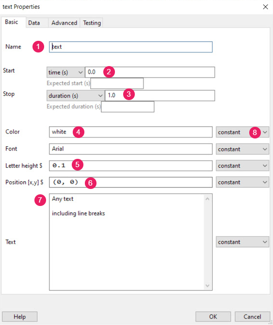 
```

]

.pull-right[
***General***

1️⃣ __ name(string)__: The name should contain only letters, numbers and underscores (no punctuation marks or spaces).

2️⃣ __start__: The time that the stimulus should first appear.

3️⃣ __stop__: The duration for which the stimulus is presented.

7️⃣ __text__: Text to be shown
]
---
### Text

.pull-left[


```{r  out.width = "70%", fig.cap= "Pop-up window for text component", dpi =96, echo=FALSE}
 
```
]

.pull-right[
***Appearance and Formatting***

4️⃣ **color**:The color of the text(right-click for more color)

5️⃣ __letter height__: The height of the characters in the given units of the stimulus/window.

6️⃣ __position__: [x, y] The position of the centre of the stimulus, in the units specified by the stimulus or window

***Static and non-static stimuli*** 😥

8️⃣ __Drop-down__: 
*Constant*: For static stimuli
*Set every repeat/ Set every frame*: For changing stimuli
]

???

Make sure that you explain "Static and non-static stimuli". 
---
### Text
.pull-left[

```{r  out.width = "70%", fig.cap= "Pop-up window for text component", dpi =96, echo=FALSE}
include_graphics("image/text-component-advanced.png") 
```
]

.pull-right[

**Units for the window and stimuli**

1️⃣ __ Unit<sup>1</sup>__

- **Height**: It is specified relative to the height of the window (note the window, not the screen). For a standard widescreen (16:10 aspect ratio) the bottom left of the screen is (-0.8,-0.5) and top-right is (+0.8,+0.5).
- **Norm**: In normalised (‘norm’) units the window ranges in both x and y from -1 to +1. That is, the top right of the window has coordinates (1,1), the bottom left is (-1,-1). 
- **pix**: The sizes are specific to the monitor (because all monitors differ in pixel size). 

.footnote[
[1] See *Additional Materials* section or [*PsychoPy website*](https://www.psychopy.org/general/units.html) for more information.]

]
---
### Image
.pull-left[


```{r  out.width = "90%", fig.cap= "Pop-up window for image component", dpi =96, echo=FALSE}
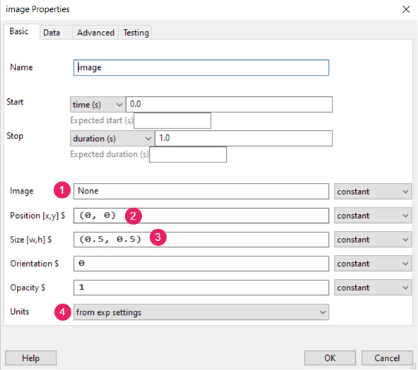 
```
]

.pull-right[

The first three variables (`name`, `start`, `stop`) are the same. 

1️⃣ __Image__: Filename of the image formats (e.g. tif, jpg, bmp, png, etc.).

2️⃣ _Position__: [x, y] The position of the centre of the stimulus, in the units specified by the stimulus or window

3️⃣ __Size__: [x, y] The size of the stimulus in the given units of the stimulus/window. 

4️⃣ __Units__: Units deg, cm, pix, norm, or inherit from window
]
---
### Image
.pull-left[


```{r  out.width = "90%", fig.cap= "Pop-up window for image component", dpi =96, echo=FALSE}
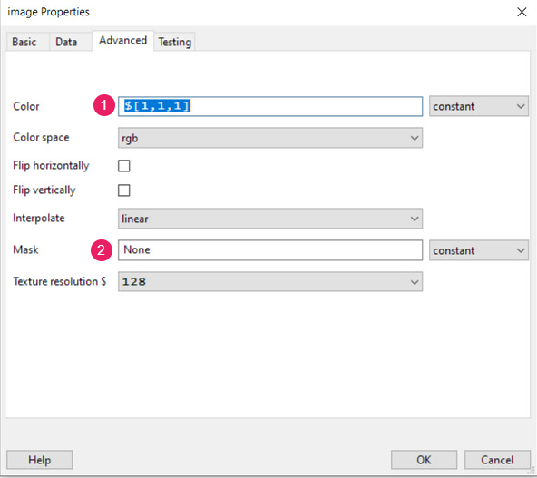 
```
]

.pull-right[

The first three variables (`name`, `start`, `stop`) are the same. 

1️⃣ __color__: The color of the text(right-click for more color.

2️⃣ __Mask__: A filename to  define the shape (e.g. circle will make the patch circular) or something which overlays the patch

]
---
### Keyboard
.pull-left[


```{r  out.width = "90%", fig.cap= "Pop-up window for keyboard component", dpi =96, echo=FALSE}
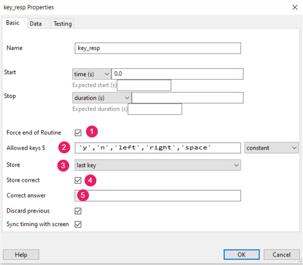 
```
]

.pull-right[
1️⃣ __Force end of Routine__: If this box is checked then the_ Routine_ will end as soon as one of the allowed keys is pressed.

2️⃣ __Allowed keys__: A list of allowed keys

3️⃣ __Store__: Store either last key, first key, all keys, nothing. The response time will also be stored if a keypress is recorded. 

4️⃣ __Store correct__: Check this box if you wish to store whether or not this key press was correct.

5️⃣ __Correct Answer__: Defines what would constitute a correct answer e.g. left, 1 or  $corrAns 
]
---
layout: false

## Add New Loop in the Flow

- We use ***Flow*** to combine a few ***Routines*** into a single experiment.
- Loops control the repetition of Routines and the choice of stimulus parameters for each. 

```{r  out.width = "50%", fig.align="center", fig.cap= "GIF for adding new loop", dpi =96, echo=FALSE}
include_graphics("gif/add-new-loop.gif") 
```

---
class: inverse, center, middle

# Getting Started <br/> <br/>(Designing Stroop Task)
---
layout: true

## Stroop Task

---

The Stroop effect is the finding that naming the color of the first set of words is easier and quicker than the second.

- In the figure shown below, the words corresponding to the colors “Red,” “Green,” and “Blue” are included, but printed in colors that do not correspond to the word (e.g., the word “Red” is printed in blue). 

- The task is to name the ink color, inhibiting the reading of the word, and the score is the number of correctly named elements. 

<br/>
```{r  out.width = "40%", fig.align="center", fig.cap= "Stroop Task", dpi =96, echo=FALSE}
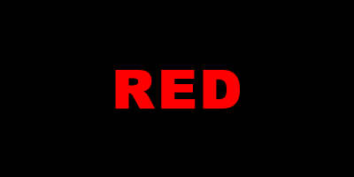
```
---
### Step 1: Download files needed

Download and unzip the file from [Github](https://github.com/sohmeiling/workshops_PsychoPy). Remember to save the folder in the Desktop 
(Warning!! Do not save the folder on a cloud-based storage such as OneDrive or Dropbox)

### Step 2: Open the PsychoPy3 Builder

In the unzipped folder, you should see multiple folders. Open the **.psyexp** file under the **practical-stroop** folder

Workshop_M_Connect  ➡️ practical-stroop  ➡️ stroop-test.psyexp

---
### Step 3: Create Stimuli

Before you create any experiment, it is important that you are familiar with the task. We designed our study based on the Stroop Color and Word Test (SCWT) in Rivera's et al. (2015) study.

There are three kinds of Stroop task: _Stroop Word_, _Stroop Color_, and _Stroop Word-Color_. We will start with _Stroop Word Task_.

> _Stroop Word Task_. The words corresponding to the colors “Red,” “Green,” and “Blue” are included, and all are printed in black ink. 


```{r  out.width = "70%", fig.align="center", fig.cap= "Stroop Task", dpi =96, echo=FALSE}
include_graphics("image/swct-ex.png")
```
---
### Step 3: Create Stimuli
We need to list out all the possible combinations of **Word Stroop**. 

```{r, echo=FALSE}

dmx <- tibble(type = c("Word", "Word", "Word"), 
  practiceWord = c("red", "green", "blue"), 
  practiceColor = c("black", "black", "black"), 
  corrResponse = c("left", "up", "right")
)

knitr::kable(head(dmx), format = 'html')

```

We have created the stimuli file for you. Please use the **wordPractice_stim.xlsx** for the following task. 

In the .xlsx file, there are _four_ variable names. 

- ***type***. The type of Stroop Task

- ***practiceWord***. The words presented on the screen

- ***practiceColor***. The colors of the words

- ***corrResponse***. The correct key responses/Answer

---
### Step 4: Create three routines

- Routine 1: Welcome Routine (name it "Welcome")
- Routine 2: Practice Routine (name it "Practice_Trial")
- Routine 3: End Routine (name it "End")

When it comes to naming the **Routine**, **variables**, and **Loop**, there are a few rules that you have to follow. For example, 
1.  Variables names must start with a letter or an underscore
2. The remainder of your variable name may consist of letters, numbers and underscores. Space is not allowed.
3. **Names are case sensitive**

For the purpose of this workshop, we have created the routines for you. You just need to click `Insert Routine` and arrange the routines in the **Flow** window, as shown in the figure below. 

```{r  out.width = "50%", fig.align="center", fig.cap= "Stroop Task", dpi =96, echo=FALSE}
include_graphics("image/stroop-add-routine.png")
```
---
### Step 5: Create components for each routine
#### Step 5.1: Create components for the Welcome routine
In the **Welcome** routine, create two components. 

- Component 1: A **Text** component (name it "welcome_text")
- Component 2: A **Keyboard** component (name it "welcome_resp")

```{r  out.width = "60%", fig.align="center", fig.cap= "Welcome Routine", dpi =96, echo=FALSE}
include_graphics("image/welcome-routine.png")
```
---
#### Step 5.2: Properties of each component in the Welcome routine

Please refer to the images below and follow the number closely.

.pull-left[
```{r  out.width = "65%", fig.cap= "welcome_text component", dpi =96, echo=FALSE}
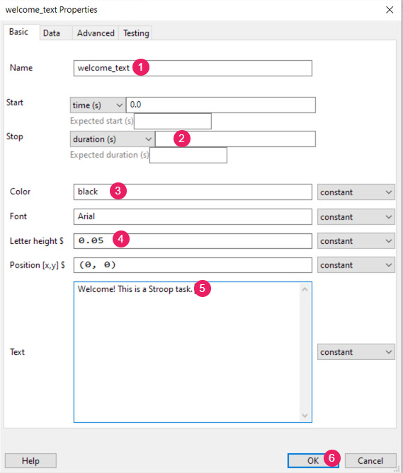
```

]

.pull-right[
```{r  out.width = "80%", fig.cap= "welcome_resp component", dpi =96, echo=FALSE}
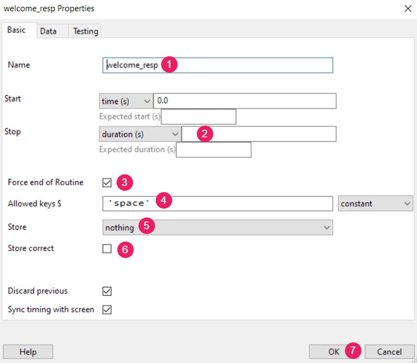
```

]
---
#### Step 5.3: Create components for the Practice_Trial routine

In the **Practice_Trial** routine, create two components. 

- Component 1: A **Text** component (name it "stim_text")
- Component 2: A **Keyboard** component (name it "practice_resp")


```{r  out.width = "60%", fig.align="center", fig.cap= "Practice_Trial Routine", dpi =96, echo=FALSE}
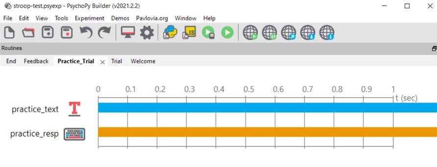
```
---
#### Step 5.4: Properties of each component in the Practice_Trial routine

Please refer to the images below and follow the number closely.

.pull-left[
```{r  out.width = "65%", fig.cap= "stim_text component", dpi =96, echo=FALSE}
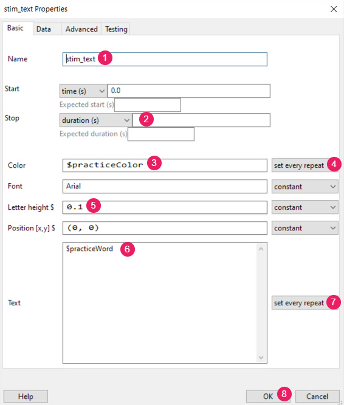
```

]

.pull-right[
```{r  out.width = "80%", fig.cap= "practice_resp component", dpi =96, echo=FALSE}
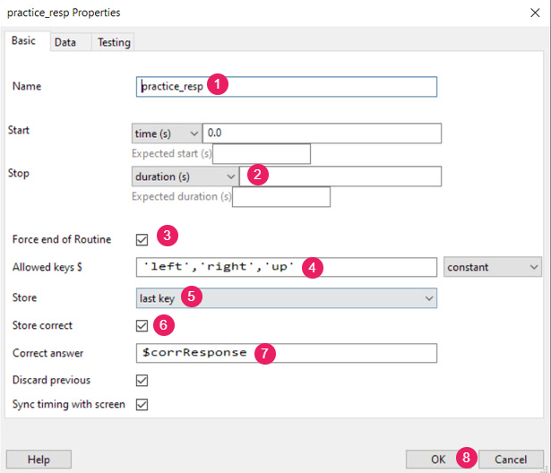
```

]
---
#### Step 5.5: Create components for the End routine

In the **End** routine, create one component. 

- Component 1: A **Text** component (name it "end_text")


```{r  out.width = "60%", fig.align="center", fig.cap= "End routine", dpi =96, echo=FALSE}
include_graphics("image/end-routine.png")
```
---
#### Step 5.6: Properties of the component in the End routine

Please refer to the images below and follow the number closely.

.pull-left[
```{r  out.width = "65%", fig.cap= "end_text component", dpi =96, echo=FALSE}
include_graphics("image/end_text.png")
```

]
---
### Step 6: Create a loop in the Flow window

In the ***Flow*** window, `Insert loop` around the _Practice_Trial_ routine

```{r  out.width = "80%", fig.cap= "Insert Loop", fig.align="center", dpi =96, echo=FALSE}
include_graphics("image/practice_loop.png")
```

---
#### Step 6.1: Properties of the _practice_loop_

```{r  out.width = "28%", fig.cap= "practice_loop properties", fig.align="center", dpi =96, echo=FALSE}
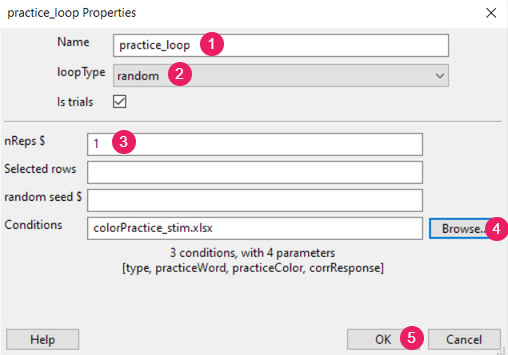
```

Note for 5️⃣. 

Make sure you are in the correct directory. If you follow earlier instruction and have saved your folder in the **Desktop**, then your filepath should be

```{r}

# Desktop\Workshop_M_Connect\Practical_Build_stroop\colorPractice_stim.xlsx

```

---
### Step 7: Save and run the study

- Make sure you consistently save your psyexp file as you program the study

- If you receive an error message, please approach the TAs in the chat. It will be helpful if you can copy and paste the error message into the chat. 

```{r  out.width = "20%", fig.cap= "Well done!", fig.align="center", dpi =96, echo=FALSE}

```

We will take a 10-minute break now. For those interested of customizing the study, please try out the practice tasks in the next two slides. 

---
layout: false

### Practice Time (5-10 minutes)

- In the **Welcome** routine, modify the `welcome_text` component. You might want to include a longer instruction for the Stroop task. For example, 

> Welcome! This is a Stroop task. <br/> 
> <br/> 
> In this task, you are asked to respond to either the words or the colors printed in “Red,” “Green,” and “Blue”. <br/> 
> <br/> 
> Select 'LEFT' for red, 'UP' for green, 'RIGHT' for blue. <br/> 
> <br/> 
> Press 'SPACE' to continue.

- In the `welcome_text` component, you can always change the color of the text. Please make sure that it follows the [accessibility code](https://www.washington.edu/accessibility/web/color/). 

- In the **Practice_Trial** routine, add another Text component to remind your participants about the keys' response. You will need to adjust the position of the text component. As we are using *height* as our unit, the range for [x, y] position is [-0.8 <x <0.8,  -0.5<y< 0.5]

> Select 'LEFT' for red, 'UP' for green, 'RIGHT' for blue.

---
### Practice Time (5-10 minutes)

- In the **Experiment Settings**, add some demographic information such as age and gender to the _Experiment Info_.  

- Also, in the **Experiment Settings**, try to change the color of the screen. Now, it is set to grey. (Tips: under the Screen tab)

---
layout: true

## Stroop Task

---
### Step 8: Create the Trial routine

- The **Trial routine** is identical to the earlier **Practice_Trial** routine. 

- Now, your task is to create the components for the **Trial** routine. 
    1. Insert the **Trial** Routine
    2. Create a Text component
    3. Create a Keyboard component
    4. Insert a Loop. Use the _WordStimuli.xlsx_  file. 

- After you are done, try to run the experiment. 

--
- You should receive an error message if you follow the properties settings in  Step 5-6. 

```{r  out.width = "20%", fig.cap= "Arghhhh!!!! What happened?", fig.align="center", dpi =96, echo=FALSE}
include_graphics("gif/error-msg.gif")
```

---
### Step 9: Understanding the error

.pull-left[
- First, look into the _WordStimuli.xlsx_  file.


```{r practice, echo=FALSE}
stim <- tibble(type = rep("Word", 6), 
               word = rep(c("red", "blue", "green"), each= 2), 
               color = rep("black", 6), 
               answer = rep(c("left", "right", "up"), each= 2)
               )
               
knitr::kable(head(stim), format = 'html')

```
]

.pull-right[
- You should realize that the variables' names have changed. 


```{r echo=FALSE}

naming <- tibble(old_names = c("type", "practiceWord", "practiceColor", "corrResponse"), 
                 new_names = c("type", "word", "color", "answer"))

knitr::kable(head(naming), format = 'html')
```
]
---
### Step 9: Understanding the error 
Now, make changes to the **Text** and **Keyboard** components. 

.pull-left[
First, 

```{r  out.width = "50%", fig.cap= "stim_text component", fig.align="center", dpi =96, echo=FALSE}

```
]

--
.pull-right[
Modify 3️⃣ and 6️⃣

]

---
### Step 9: Understanding the error 

--
.pull-left[
Next, 

```{r  out.width = "80%", fig.cap= "practice_resp component", fig.align="center", dpi =96, echo=FALSE}

```
]
--

.pull-right[
Modify 7️⃣
]

---
### Step 10: Counterbalancing

#### Blocking similar conditions 

Counterbalancing requires a bit of thinking! In our Stroop Task, we have three types of Stroop but if you look carefully, these three tasks are very similar. So, you should not create different Routines for different trials in your blocks (if at all possible). 

- Look at the .xlsx file for the **Practice_Trial** routine. We have created two .xlsx files for _Stroop word Practice_ routine and _Stroop Color Practice_ routine. Both _xlsx_ files have identical variable names. 

<br/>

.pull-left[
```{r  out.width = "100%", fig.cap= "wordPractice_stim.xlsx", dpi =96, echo=FALSE}
include_graphics("image/word-practice.png")
```

]

--
.pull-right[
```{r  out.width = "80%", fig.cap= "colorPractice_stim.xlsx", dpi =96, echo=FALSE}
include_graphics("image/color-practice.png")
```

]

---
### Step 10: Counterbalancing (Blocking similar conditions) 

--
We can collapse both files into a single ***Loop***. 

--
1. In the outer (blocks) loop you set up the conditions file to be conditions.xlsx which creates a variable practiceFile. 

2. Then, in the inner (trials) loop you set the conditions file not to be any file directly but simply $practiceFile. 

3. When PsychoPy starts the loop, it will find the current value of practiceFile and insert the appropriate thing, which will be the name of an conditions file and voila, we're done with counterbalancing. 

```{r  out.width = "30%", fig.cap= "The conditions.xlsx file", fig.align="center", dpi =96, echo=FALSE}
include_graphics("image/conditions.png")
```

---
### Step 10: Counterbalancing (Blocking similar conditions)

```{r  out.width = "60%", fig.cap= "The Flow layout", fig.align="center", dpi =96, echo=FALSE}

```

---
### Practice Time (5-10 minutes)

***Practice***

1. This time, you try to create a counterbalancing loop for the **Trial** routine. Use the conditions.xlsx file. 

2. Try to add instructions for your participants, informing them if the following trial is a Word Stroop, Color Stroop, or Word-color Stroop. 

---
### Step 11: Launch the study online

Before you push your study to Pavlovia, make sure that: 

1. You have login into your Pavlovia account. 
2. You have test-run the experiment and it works on PsychoPy. 
--

```{r  out.width = "50%", fig.cap= "GIF for launching online", fig.align="center", dpi =96, echo=FALSE}

```

---
layout: false

background-image: url("gif/pavlovia.gif")
background-position: center
background-size: contain

---
class: inverse, center, middle

# Additional Materials
---
layout: true

## Units and Scaling

---
- An important factor to consider when running online experiments is the standardization of stimuli size across participants who will likely be using different monitors. 

- To do so, we need to know a bit about the types of units in PsychoPy:

.center[]

```{r  out.width = "30%", fig.cap= "Drop-down list for units", fig.align="center", dpi =96, echo=FALSE}

```

---
- **Height**

    - Everything is specified relative to the height of the window (note the window, not the screen)

- **Norm**

    - Everything is specified relative to the X, Y dimensions of the window (note the window, not the screen)

- **Cm**

    - Set the size and location of the stimulus in centimeters on the screen, can be verified by “drawing” a stimulus and measuring the dimensions to check that its indeed a square

- **Deg/DegFlat/DegFlatPos**

    - Use degrees of visual angle to set the size and location of the stimulus. Dependent on the distance that the participant sits from the screen as well as the screen itself

- **Pix**

    - Specify the size and location of your stimulus in pixels, Dependent on the pixel size of monitor

---
### Friendly Advice

😉 We recommend sticking to **Height** and **Norm** units if your experiment is not too concerned with stimulus size. 

😉 If stimulus size needs to be kept constant, then using **Cm, Deg, Pix** units is recommended as those do not scale with window size

---
### This is for the PRO ones

- Typically, we can standardize stimuli according to participants’ window dimension by getting participants to compare a common real-world object with a standardized size on the screen (i.e. credit cards). 

- Scaling task allows the experiment to obtain the dimensions of the screen relative to each participant, and you can then use that information to scale your stimuli accordingly. 


.center[]
.center[TIP: You can find many experimental templates like this on Pavlovia
]

---
background-image: url("image/wakefield-screen-scale.png")
background-position: center
background-size: contain

layout: false

---
layout: true

## Data Analysis

---

- Running experiments offline would store participants data locally on your hard drive. Using Pavlovia, participants data are stored in the cloud

- Data for **each** participant would be stored in an .csv file. If you have 50 participants, you will have 50 .csv files

- Usually, you would need to use some coding software (e.g. Python, R) to clean your data and aggregate them 

- For the purposes of this workshop, we will not go over how to clean/aggregate your data, rather, we will explore the kinds of raw data you can obtain

- At this stage, if your naming of your routines/components are not consistent or clear, you may have a very rough time understanding what’s going on. Particularly if you are collaborating with others, its very crucial to have simple naming rules.

---
### Explore your data file

- In your data file, there are some keywords that can help you identify the type of data being stored:


| variables' name | Description 
| :---: | :---: 
| .thisRepN/TrialN/N/Index | Counts how many stimuli/trials have passed
| .start/stopped | Counts the seconds when a stimulus is presented/stopped
| .keys | Logs the key press by the participants
| .rt | Logs the reaction time (seconds) taken to press a valid key(s)
| .corr | Logs the accuracy (1 = correct, 0 = wrong)


---
class: center, middle

# Thanks!

Slides created via the R packages:

[**xaringan**](https://github.com/yihui/xaringan)<br> 
[gadenbuie/xaringanthemer](https://github.com/gadenbuie/xaringanthemer)

The chakra comes from [remark.js](https://remarkjs.com), [**knitr**](http://yihui.name/knitr), and [R Markdown](https://rmarkdown.rstudio.com).
